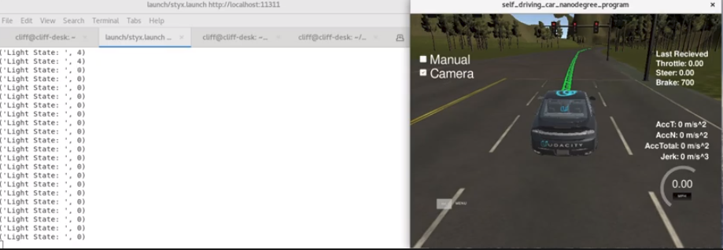
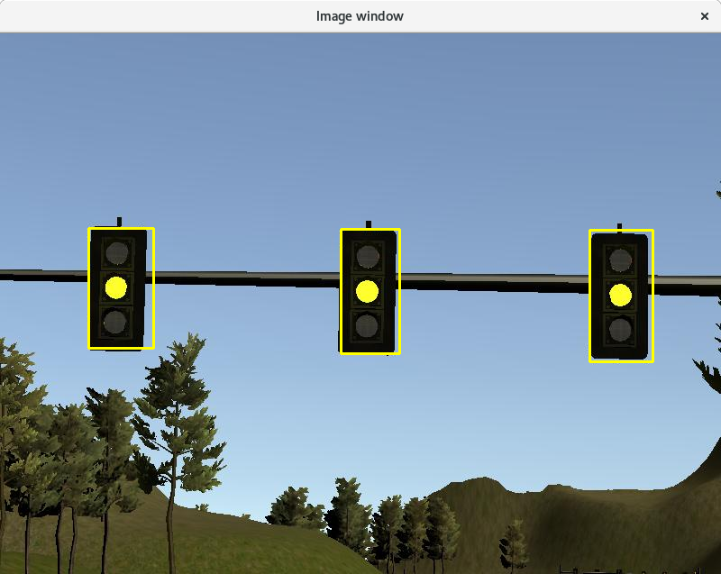
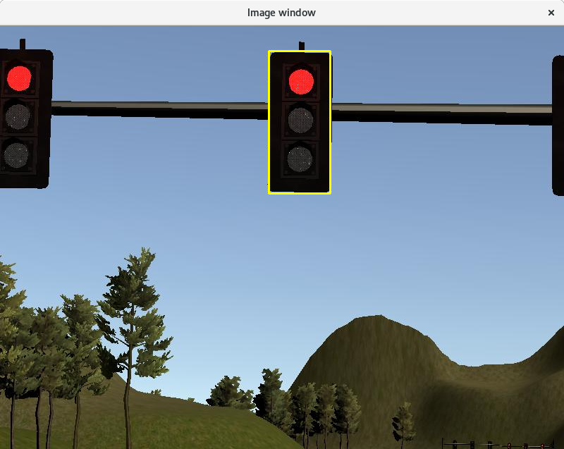
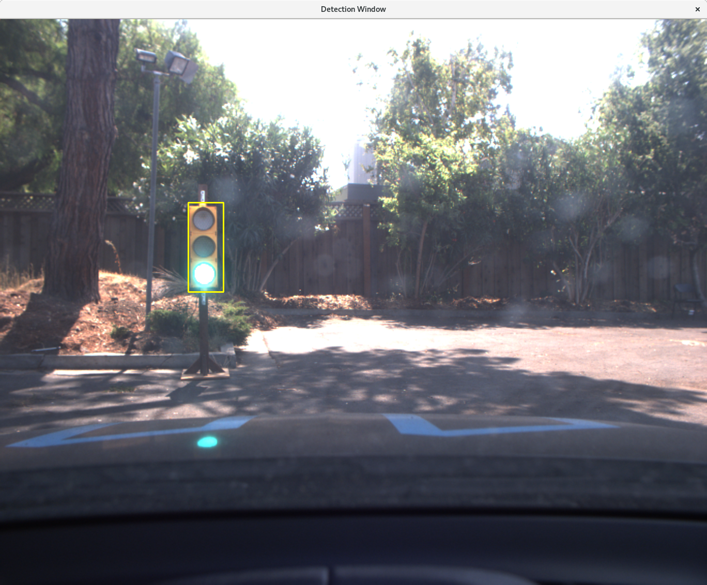

# CarND-Capstone

**NOTE: This project was built natively on Ubuntu Ubuntu 17.10 using ROS Melodic Morenia.
**Hardware specs are:
**    Intel® Core™ i7-4710HQ CPU @ 2.50GHz × 8 
**    GeForce GTX 760/PCIe/SSE2 -- NOT USED Due to ROS conflicts!

In this project, we configure and execute a system itegrated solution that runs in a simulator and on Udacity's Carla automobile.   
   
## Goals
1. Launch correctly using the launch files provided in the capstone repo. The launch/styx.launch and launch/site.launch files will be used to test code in the simulator and on the vehicle respectively.  


Note the site.launch did not transmit traffic light waypoint information. Thus the course code is incomplete. I have a flag called USE_WAYPOINT_PUBLISHER when set to false bypasses the traffic light waypoint requirements.


2. Smoothly follow waypoints in the simulator. Since I had nummerous ROS integration errors with Python and usage of a GPU, I have to run image processing and AI routines at 10hz. I could not run at framerate (50hz) as my cpu would bog down.

3. Respect the target top speed set for the waypoints' twist.twist.linear.x in waypoint_loader.py. We ran at 40km/hr which in the simluator is about 24mph. This was confirmed in the video below.

4. Stop at traffic lights when needed. This was confirmed in the video below.

5. Stop and restart PID controllers depending on the state of /vehicle/dbw_enabled. Publish throttle, steering, and brake commands at 50hz. This was confirmed in the video below. And running "rostopic hz"


Simulator result using simulator/styx (VIDEO):

[](https://youtu.be/ElpkiZRLsCU "Click to Play Video")


## Notes

### The following system architecture was used:


### For traffic light detection, I used the Tensorflow model zoo: ssd_mobilenet_v1_coco_11_06_2017 frozen graph, which I included in this repo.

This graph is based on training with the COCO dataset and has a traffic light class. After detection of traffic lights, I was able to perform detection of the light color using similar techniques as from the Advanced-Lane-Lines project I completed eariler in the course.

Styx mode (styx.launch)





Site mode (site.launch)




## Compiling on Udacity workspace
 
catkin_make may present errors like: 
  
    dbw_mkz_msgsConfig.cmake
    dbw_mkz_msgs-config.cmake

And can be solved with:

sudo apt-get update
sudo apt-get install -y ros-kinetic-dbw-mkz-msgs
cd /home/workspace/CarND-Capstone/ros
rosdep install --from-paths src --ignore-src --rosdistro=kinetic -y


This is the project repo for the final project of the Udacity Self-Driving Car Nanodegree: Programming a Real Self-Driving Car. For more information about the project, see the project introduction [here](https://classroom.udacity.com/nanodegrees/nd013/parts/6047fe34-d93c-4f50-8336-b70ef10cb4b2/modules/e1a23b06-329a-4684-a717-ad476f0d8dff/lessons/462c933d-9f24-42d3-8bdc-a08a5fc866e4/concepts/5ab4b122-83e6-436d-850f-9f4d26627fd9).

Please use **one** of the two installation options, either native **or** docker installation.

### Native Installation

* Be sure that your workstation is running Ubuntu 16.04 Xenial Xerus or Ubuntu 14.04 Trusty Tahir. [Ubuntu downloads can be found here](https://www.ubuntu.com/download/desktop).
* If using a Virtual Machine to install Ubuntu, use the following configuration as minimum:
  * 2 CPU
  * 2 GB system memory
  * 25 GB of free hard drive space

  The Udacity provided virtual machine has ROS and Dataspeed DBW already installed, so you can skip the next two steps if you are using this.

* Follow these instructions to install ROS
  * [ROS Kinetic](http://wiki.ros.org/kinetic/Installation/Ubuntu) if you have Ubuntu 16.04.
  * [ROS Indigo](http://wiki.ros.org/indigo/Installation/Ubuntu) if you have Ubuntu 14.04.
* [Dataspeed DBW](https://bitbucket.org/DataspeedInc/dbw_mkz_ros)
  * Use this option to install the SDK on a workstation that already has ROS installed: [One Line SDK Install (binary)](https://bitbucket.org/DataspeedInc/dbw_mkz_ros/src/81e63fcc335d7b64139d7482017d6a97b405e250/ROS_SETUP.md?fileviewer=file-view-default)
* Download the [Udacity Simulator](https://github.com/udacity/CarND-Capstone/releases).

### Docker Installation
[Install Docker](https://docs.docker.com/engine/installation/)

Build the docker container
```bash
docker build . -t capstone
```

Run the docker file
```bash
docker run -p 4567:4567 -v $PWD:/capstone -v /tmp/log:/root/.ros/ --rm -it capstone
```

### Port Forwarding
To set up port forwarding, please refer to the [instructions from term 2](https://classroom.udacity.com/nanodegrees/nd013/parts/40f38239-66b6-46ec-ae68-03afd8a601c8/modules/0949fca6-b379-42af-a919-ee50aa304e6a/lessons/f758c44c-5e40-4e01-93b5-1a82aa4e044f/concepts/16cf4a78-4fc7-49e1-8621-3450ca938b77)

### Usage

1. Clone the project repository
```bash
git clone https://github.com/udacity/CarND-Capstone.git
```

2. Install python dependencies
```bash
cd CarND-Capstone
pip install -r requirements.txt
```
3. Make and run styx
```bash
cd ros
catkin_make
source devel/setup.sh
roslaunch launch/styx.launch
```
4. Run the simulator

### Real world testing
1. Download [training bag](https://s3-us-west-1.amazonaws.com/udacity-selfdrivingcar/traffic_light_bag_file.zip) that was recorded on the Udacity self-driving car.
2. Unzip the file
```bash
unzip traffic_light_bag_file.zip
```
3. Play the bag file
```bash
rosbag play -l traffic_light_bag_file/traffic_light_training.bag
```
4. Launch your project in site mode
```bash
cd CarND-Capstone/ros
roslaunch launch/site.launch
```
5. Confirm that traffic light detection works on real life images
